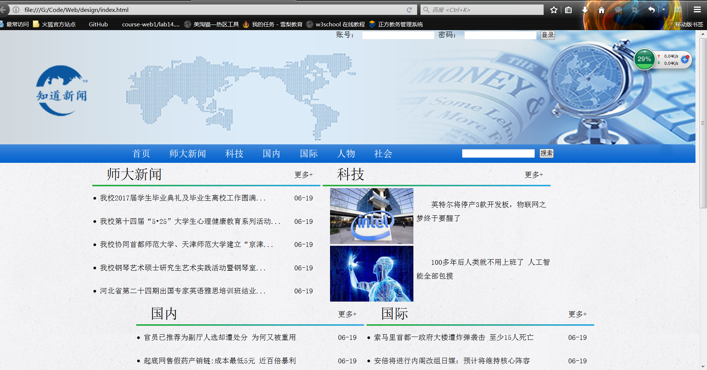
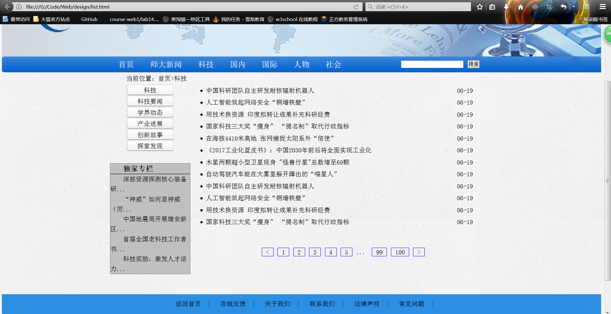
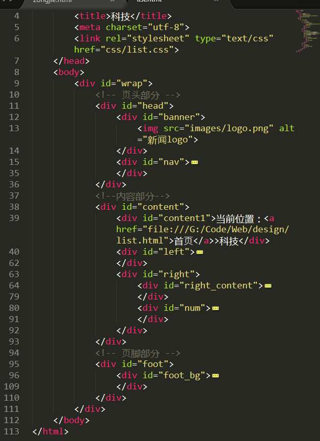
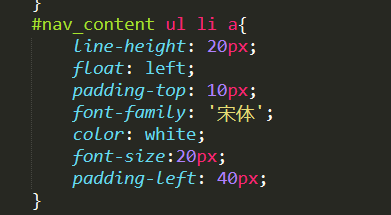
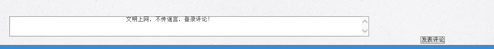
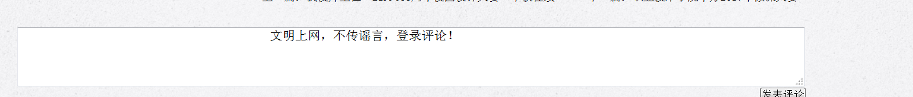

#【课程设计名称】
##设计目的

1.熟练掌握HTML在组织结构上的优势。

2.熟练掌握CSS在网页布局中的应用。

3.学习Web标准及浏览器的兼容性。

##设计步骤
###1. 功能性需求分析

该网站共有3个页面，其中每一个页面的屏幕截图及主要功能如下所列。

（1） 首页：

	屏幕截图：

    主要实现功能：展示不同板块的大概内容
    导航栏功能：设置不同板块的链接  搜素框方便用户搜索本站内容
（2） 列表页：

	屏幕截图：

	主要实现功能：本版块的新闻逐条显示
（3）内容页：

	屏幕截图：

	主要实现功能：详细展示每条新闻的内容，也可以让用户即时评论本新闻和展示其他用户的评论内容。
###2. 搜集网站素材

	素材网站：千图网  河北师大官网 搜狐新闻...
###3. 建立网站代码目录结构

###4. 编写HTML代码

（1） 首页部分：

    整体结构： 核心源代码：
	

				

					<form id="input">
						账号：
						<input type="text" name="Name" />
						密码：
						<input type="password" name="Pass"  />
						<input type="submit" name="login" value="登录"/>
					</form>
				

				

					
				

				

					

						

							<ul>
								<li><a href="file:///G:/Code/Web/design/index.html"> 首页</a></li>
								<li><a href="file:///G:/Code/Web/design/content.html">师大新闻</a></li>
								<li><a href="file:///G:/Code/Web/design/list.html#">科技</a></li>
								<li><a href="#">国内</a></li>
								<li><a href="#">国际</a></li>
								<li><a href="#">人物</a></li>
								<li><a href="#">社会</a></li>
							</ul>
						

						

							<form>
								<input id="text" type="text"/>
								<input id="button" type="button" value="搜索" />
							</form>
						

					

				

			

（2） 列表页：
	核心代码：

	

						<ul>
							<li class="top"><a href="file:///G:/Code/Web/design/list.html">科技</a></li>
							<li class="top"><a href="#">科技要闻</a></li>
							<li class="top"><a href="#">学界动态</a></li>
							<li class="top"><a href="#">产业进展</a></li>
							<li class="top"><a href="#">创新故事</a></li>
							<li class="top"><a href="#">探索发现</a></li>
						</ul>
					

					

						<h3><a href="#">独家专栏</a></h3>
						

						<ul>
							<li><a href="#">深部资源探测核心装备研...</a></li>
							<li><a href="#">“神威”如何显神威（厉...</a></li>
							<li><a href="#">中国地震局开展雄安新区...</a></li>
							<li><a href="#">首届全国老科技工作者书...</a></li>
							<li><a href="#">科技奖励，激发人才活力...</a></li>
						</ul>
					

				

				

					

						<ul>
							<li><a href="#">中国科研团队自主研发耐核辐射机器人</a>06-19</li>
							<li><a href="#">人工智能筑起网络安全“铜墙铁壁”</a>06-19</li>
							<li><a href="#">用技术换资源 印度拟转让成果补充科研经费</a>06-19</li>
							<li><a href="#">国家科技三大奖“瘦身” “提名制”取代行政指标</a>06-19</li>
							<li><a href="#">在海拔4410米高地 张网捕捉太阳系外“信使”</a>06-19</li>
							<li><a href="#">《2017工业化蓝皮书》：中国2030年前后将全面实现工业化</a>06-19</li>
							<li><a href="#">木星两颗超小型卫星现身 "怪兽行星"总数增至69颗</a>06-19</li>
							<li><a href="#">自动驾驶汽车能在大雾里躲开蹿出的“喵星人”</a>06-19</li>
							<li><a href="#">中国科研团队自主研发耐核辐射机器人</a>06-19</li>
							<li><a href="#">人工智能筑起网络安全“铜墙铁壁”</a>06-19</li>
							<li><a href="#">用技术换资源 印度拟转让成果补充科研经费</a>06-19</li>
							<li><a href="#">国家科技三大奖“瘦身” “提名制”取代行政指标</a>06-19</li>
						</ul>
					

（3） 内容页面：
	核心代码：

	

						<ul>
							<li class="top"><a href="file:///G:/Code/Web/design/content.html">师大新闻</a></li>
							<li class="top"><a href="#">新闻在线</a></li>
							<li class="top"><a href="#">学术活动</a></li>
							<li class="top"><a href="#">通知公告</a></li>
							<li class="top"><a href="#">图书馆</a></li>
							<li class="top"><a href="#">网上办公</a></li>
						</ul>
					

					<!--评论展示区-->
					

						

							
最热评论

							

								

									
匿名用户

									
怀天下，求真知

									<a href="#">分享</a>
									<a href="#">回复</a>
								

								
							

						

					

--
				<form id="write">
					<textarea rows="3" cols="121" >
					文明上网，不传谣言，登录评论！
					</textarea> 
					<input id="input" type="submit" value="发表评论" name="sub"/>
				</form>

###5. 编写CSS布局及样式

（1） CSS布局：
	

...
    

（2） 添加CSS样式：

	通用样式：

	*{
		margin: 0 auto;padding: 0;color: black;
		font-family: '宋体';
		list-style-type: none;
		}
		a:link{text-decoration: none;color: black;
		}
		a:hover{text-decoration: underline;
			color:red;
		}
		#wrap{
		margin: 0 auto;
		background-image: url(../images/bg.jpg);
		}
	背景相关：
	
	background-image: url(../images/index_h1.gif);
	background-repeat: no-repeat;
	background-position: center bottom;

	.top_pic{
		width: 179px;
		height: 120px;
		background-image: url(../images/intel.jpg);
		background-repeat: no-repeat;
		float: left;
		}

	

	
    

###6. 调试浏览器兼容性

（1） 问题1：

    在IE10+中的表现（屏幕截图）：

    在火狐中的表现（屏幕截图）：

    在Chrome中的表现（屏幕截图）：

###7.问题记录

    问题表现：评论框大小改变。未解决！

###8.设计总结

    需求分析阶段的经验：需求分析阶段要多参考同类型的网站，找出共同点和不同点总结其中的利弊。

    编写代码和设置CSS样式阶段的经验：编写时要按从整体到局部的顺序写，这样可以做到结构清晰，不会丢落内容

    CSS布局的经验:布局时可以现想一个大概的结构然后再根据显示效果做进一步的调试，尽量的做到完美。

    调整浏览器兼容性经验：调整兼容性时可以同时用不同浏览器打开网页对比寻找出错的地方，再用审查元素检查错误出在哪里，然后根据浏览器进行修改。

###9.课程小结

    网上参考的内容：师大新闻板块内容摘自河北师范大学官网，其他新闻题目摘自 网易新闻 搜狐新闻 人民网...

    浏览器对CSS的兼容性上的不同表现：不同浏览器的默认宽度不同，会对一些css样式的显示造成错误。

